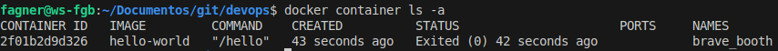
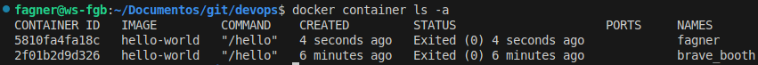
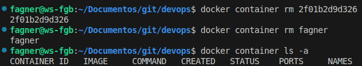
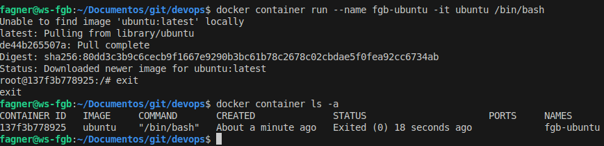
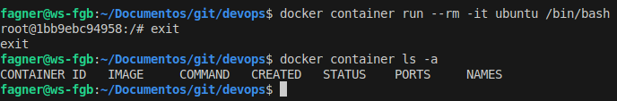
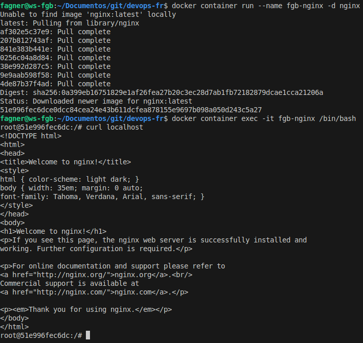
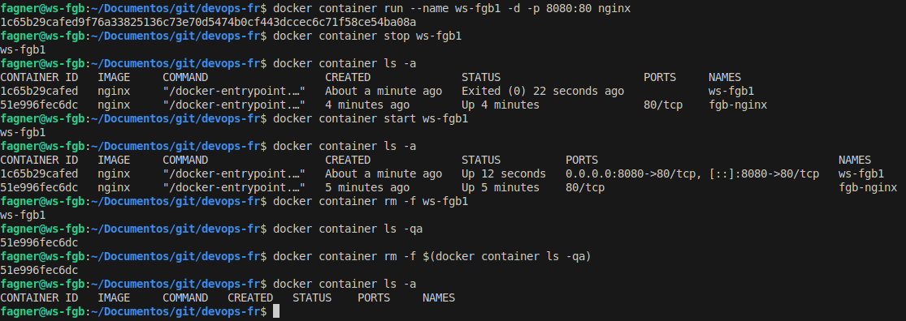
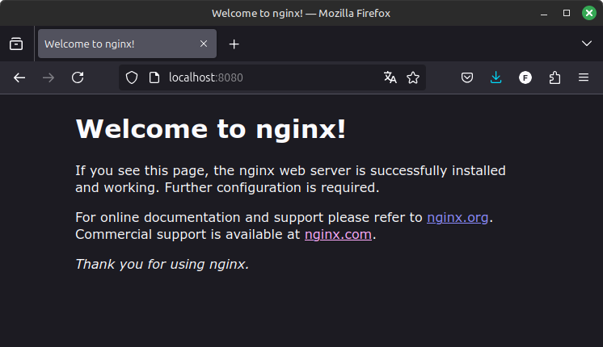
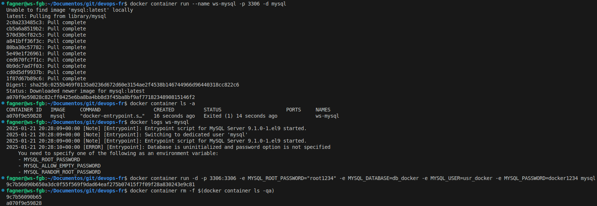
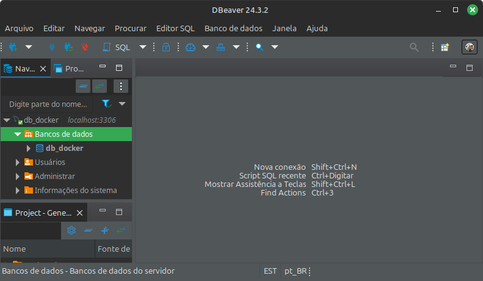

#Auteur : Fagner Geraldes Braga  
#Date de création : 21/01/2025  
#Date de mise à jour : 21/01/2025  
#Version : 0.01  

### Premiers pas avec Docker
```bash
# exécute un conteneur Docker
docker container run hello-world

# liste les conteneurs en cours d'exécution
docker container ls

# liste tous les conteneurs
docker container ls -a
```



```bash
# exécute un conteneur et spécifie un nom
docker container run --name fagner hello-world

# liste tous les conteneurs
docker container ls -a
```


```bash
# supprime un conteneur par son ID
docker container rm 2f01b2d9d326

# supprime un conteneur par son nom
docker container rm fagner

# liste tous les conteneurs
docker container ls -a
```


```bash
# exécute un conteneur en mode interactif (-i) et active le terminal (-t)
docker container run -it ubuntu /bin/bash

# supprime un conteneur par son nom
docker container rm fgb-ubuntu

# liste tous les conteneurs
docker container ls -a
```


```bash
# exécute un conteneur et le supprime automatiquement à la fin de son exécution
docker container run --rm -it ubuntu /bin/bash

# liste tous les conteneurs
docker container ls -a
```


```bash
# exécute un conteneur Nginx
# le terminal reste bloqué car le conteneur fonctionne en continu
docker container run nginx

# exécute le conteneur et libère le terminal
docker container run --name fgb-nginx -d nginx

# place un conteneur spécifique en mode interactif
docker container exec -it fgb-nginx /bin/bash

# test du fonctionnement de Nginx à l'intérieur du conteneur
curl localhost
```

### Publication de ports
```bash
# exécute un conteneur avec l'image Nginx
# en utilisant le port 8080 de l'hôte et le port 80 du conteneur
docker container run --name ws-fgb1 -d -p 8080:80 nginx

# arrête l'exécution d'un conteneur
docker container stop ws-fgb1

# liste tous les conteneurs
docker container ls -a

# démarre l'exécution d'un conteneur
docker container start ws-fgb1

# liste tous les conteneurs
docker container ls -a

# supprime un conteneur de manière forcée
docker container rm -f ws-fgb1

# liste les IDs de tous les conteneurs
docker container ls -qa

# supprime tous les conteneurs de manière forcée
docker container rm -f $(docker container ls -qa)

# liste les conteneurs
docker container ls -a

```



### Variables d'environnement
```bash
# exécution d'un conteneur MySQL
# cela entraînera une erreur car les données de configuration MySQL sont manquantes
docker container run --name ws-mysql -p 3306 -d mysql

# liste tous les conteneurs
docker container ls -a

# consulte les journaux du conteneur MySQL
docker logs ws-mysql

# exécution du conteneur MySQL avec les données d'accès configurées
docker container run -d -p 3306:3306 -e MYSQL_ROOT_PASSWORD="root1234" -e MYSQL_DATABASE=db_docker -e MYSQL_USER=usr_docker -e MYSQL_PASSWORD=docker1234 mysql

# supprime tous les conteneurs de manière forcée
docker container rm -f $(docker container ls -qa)
```



