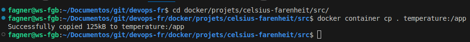
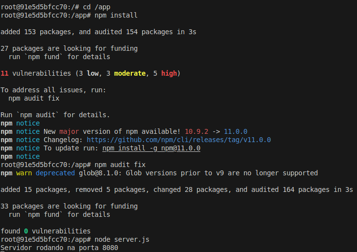
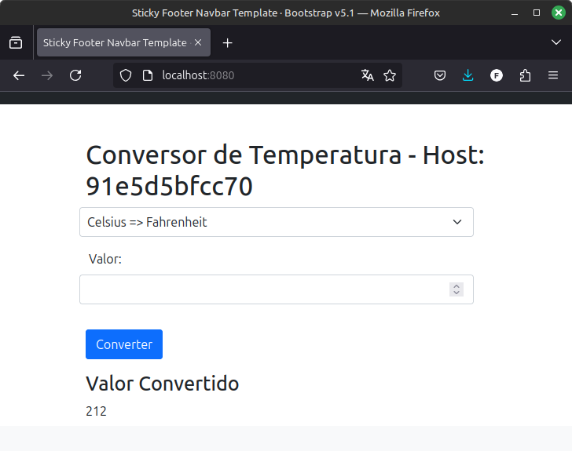

#Auteur : Fagner Geraldes Braga  
#Date de création : 22/01/2025  
#Date de mise à jour : 22/01/2025  
#Version : 0.01  

### Exécution de l'application dans un conteneur
```bash
# Accède au répertoire où se trouve le projet "celsius-farenheit"
cd docker/projets/celsius-farenheit/src/

# Exécute un conteneur appelé "temperature" de manière interactive, en mappant le port 8080 de l'hôte au port 8080 du conteneur, en utilisant l'image Ubuntu
docker container run --name temperature -it -p 8080:8080 ubuntu /bin/bash
```
### Installation de Node.js dans le conteneur
```bash
# Met à jour la liste des paquets disponibles dans les dépôts configurés
apt update

# Installe l'utilitaire curl pour le transfert de données via HTTP, HTTPS, FTP, etc.
apt-get install -y curl

# Télécharge le script de configuration du dépôt Nodesource pour installer la version 23.x de Node.js
curl -fsSL https://deb.nodesource.com/setup_23.x -o nodesource_setup.sh

# Exécute le script téléchargé pour configurer le dépôt Node.js sur le système
bash nodesource_setup.sh

# Installe Node.js à partir du dépôt configuré par le script
apt-get install -y nodejs

# Affiche la version installée de Node.js pour vérifier l'installation
node -v
```
### Copie du répertoire de l'application du serveur vers le conteneur
```bash
# Copie le contenu du répertoire actuel (.) vers le répertoire "/app" dans le conteneur Docker identifié par le nom "temperature"
docker container cp . temperature:/app
```

### Installation et exécution de l'application dans le conteneur
```bash
# Navigue vers le répertoire "/app" dans le système de fichiers ou le conteneur
cd /app

# Installe les dépendances du projet définies dans le fichier package.json
npm install

# Lance une commande pour corriger automatiquement les vulnérabilités trouvées dans les dépendances npm
npm audit fix

# Démarre le serveur du projet en utilisant le fichier server.js
node server.js
```


