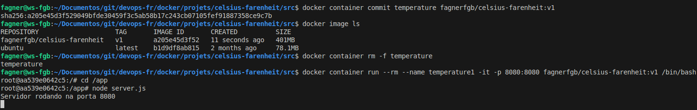
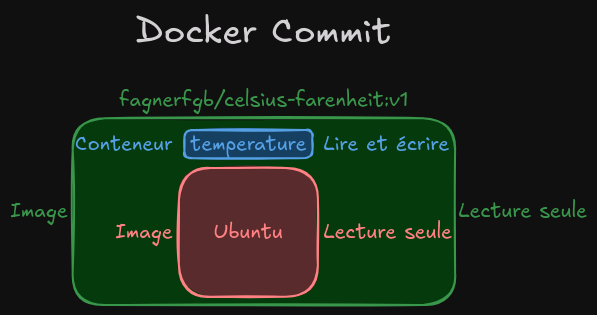

#Auteur : Fagner Geraldes Braga  
#Date de création : 23/01/2025  
#Date de mise à jour : 23/01/2025  
#Version : 0.01  

### Docker Commit

```bash
# Enregistre les modifications du conteneur 'temperature' dans une nouvelle image Docker appelée 'fagnerfgb/celsius-farenheit:v1'
docker container commit temperature fagnerfgb/celsius-farenheit:v1

# Liste toutes les images Docker présentes sur le système
docker image ls

# Supprime de force le conteneur nommé 'temperature'
docker container rm -f temperature
```
### Exécution du conteneur avec l’image créée
#### Exemple 1
```bash
# Exécute un conteneur basé sur l'image 'fagnerfgb/celsius-farenheit:v1'
# --rm : Supprime automatiquement le conteneur lorsqu'il est arrêté
# --name temperature1 : Nomme le conteneur 'temperature1'
# -it : Lance le conteneur en mode interactif avec un terminal
# -p 8080:8080 : Mappe le port 8080 de l'hôte vers le port 8080 du conteneur
# /bin/bash : Lance une session bash dans le conteneur
docker container run --rm --name temperature1 -it -p 8080:8080 fagnerfgb/celsius-farenheit:v1 /bin/bash

# Navigue vers le répertoire "/app" dans le système de fichiers ou le conteneur
cd /app

# Démarre le serveur du projet en utilisant le fichier server.js
node server.js

# Quitte le terminal interactif et arrête le conteneur (si --rm est utilisé, il sera également supprimé)
exit
```

#### Exemple 2
```bash
# Démarre un conteneur en arrière-plan nommé "temperature2", expose le port 8081 local au port 8080 du conteneur, et exécute l'application Node.js
docker container run --name temperature2 -d -p 8081:8080 fagnerfgb/celsius-farenheit:v1 node /app/server.js

# Force la suppression du conteneur nommé "temperature2"
docker container rm -f temperature2
```
### Comprendre mieux l’image
```bash
# Affiche l'historique des couches de l'image Docker spécifiée
docker image history fagnerfgb/celsius-farenheit:v1

# Affiche les métadonnées détaillées de l'image Docker spécifiée
docker image inspect fagnerfgb/celsius-farenheit:v1
```
