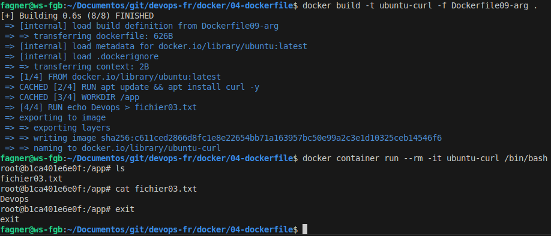

#Auteur : Fagner Geraldes Braga  
#Date de création : 24/01/2025  
#Date de mise à jour : 27/01/2025  
#Version : 0.02  

## Tous les fichiers Dockerfile de cette section se trouvent dans le dossier 04-dockerfile
### Dockerfile01
[Dockerfile01](04-dockerfile/Dockerfile01)

### Création d'une image à partir du Dockerfile et exécution du conteneur avec la nouvelle image
```bash
# Navigue vers le répertoire "docker/04-dockerfile/", où se trouve le Dockerfile
cd docker/04-dockerfile

# Construit une image Docker appelée "ubuntu-curl" à partir du Dockerfile "Dockerfile01" dans le répertoire actuel
docker build -t ubuntu-curl -f Dockerfile01 .

# Liste toutes les images Docker disponibles localement
docker image ls

# Exécute un conteneur interactif de l'image "ubuntu-curl" et ouvre un terminal bash
docker container run --rm -it ubuntu-curl /bin/bash

# Exécute la commande curl
curl

# Quitte le terminal interactif du conteneur
exit
```


### Création d'une image à partir du Dockerfile sans utiliser le cache
```bash
# Construit une image Docker appelée "ubuntu-curl" à partir du Dockerfile "Dockerfile01" dans le répertoire actuel,
# en utilisant l'option "--no-cache" pour s'assurer que la construction est effectuée sans utiliser le cache des couches précédentes
docker build -t ubuntu-curl -f Dockerfile01 . --no-cache
```

### WORKDIR
### Dockerfile02-workdir

[Dockerfile02-workdir](04-dockerfile/Dockerfile02-workdir)

```bash
# Construit une image Docker appelée "ubuntu-curl" à partir du Dockerfile "Dockerfile02-workdir" dans le répertoire actuel
docker build -t ubuntu-curl -f Dockerfile02-workdir .

# Exécute le conteneur "ubuntu-curl" en mode interactif (-it) et ouvre le terminal bash dans le conteneur
docker container run --rm -it ubuntu-curl /bin/bash

# Affiche le répertoire de travail actuel
pwd

# Quitte le terminal interactif du conteneur
exit
```


### COPY
```bash
# Crée un fichier nommé "fichier.txt" (ou écrase s'il existe déjà) et y écrit le texte "Fichier"
echo "Fichier" > fichier.txt

```
### Dockerfile03-copy
[Dockerfile03-copy](04-dockerfile/Dockerfile03-copy)

```bash
# Construit l'image Docker appelée "ubuntu-curl" à partir du Dockerfile03-copy dans le répertoire actuel.
# L'option "-f" spécifie le Dockerfile à utiliser pour la construction de l'image.
docker build -t ubuntu-curl -f Dockerfile03-copy .

# Exécute un conteneur de l'image "ubuntu-curl" en mode interactif (-it) et accède au terminal bash dans le conteneur
docker container run --rm -it ubuntu-curl /bin/bash

# Affiche la liste des fichiers et répertoires dans le répertoire actuel
ls

# Affiche le contenu du fichier "fichier.txt"
cat fichier.txt

# Quitte le terminal ou le conteneur actuel
exit
```

### ADD
### Dockerfile04-add
[Dockerfile04-add](04-dockerfile/Dockerfile04-add)

```bash
# Construit l'image Docker appelée "ubuntu-curl" à partir du Dockerfile04-add dans le répertoire actuel.
# L'option "-f" spécifie le Dockerfile à utiliser pour la construction de l'image.
docker build -t ubuntu-curl -f Dockerfile04-add .

# Exécute un conteneur de l'image "ubuntu-curl" en mode interactif (-it) et accède au terminal bash dans le conteneur
docker container run --rm -it ubuntu-curl /bin/bash

# Affiche la liste des fichiers et répertoires dans le répertoire actuel
ls

# Quitte le terminal ou le conteneur actuel
exit
```

```bash
# Crée un nouveau répertoire appelé "test" dans le répertoire actuel
mkdir test

# Crée un fichier nommé fichier02.txt dans le répertoire test et ajoute le texte "Fichier02" dedans
echo "Fichier02" > test/fichier02.txt

# Crée un fichier compressé au format .tar.gz à partir du répertoire test
# L'option -z applique la compression gzip, -v active le mode verbose (affiche ce qui est fait), et -c crée le fichier tar
tar -zvcf test.tar.gz test/

# Supprime récursivement le répertoire "test" et tout son contenu
rm -rf test/
```

### Dockerfile05-add
[Dockerfile05-add](04-dockerfile/Dockerfile05-add)

```bash
# Construit l'image Docker appelée "ubuntu-curl" à partir du Dockerfile05-add dans le répertoire actuel.
# L'option "-f" spécifie le Dockerfile à utiliser pour la construction de l'image.
docker build -t ubuntu-curl -f Dockerfile05-add .

# Exécute un conteneur de l'image "ubuntu-curl" en mode interactif (-it) et accède au terminal bash dans le conteneur
docker container run --rm -it ubuntu-curl /bin/bash

# Affiche la liste des fichiers et répertoires dans le répertoire actuel et dans les sous-répertoires,
# avec des informations détaillées sur la taille, les permissions, etc.
ls -lhR

# Quitte le terminal ou le conteneur actuel
exit
```


### LABEL
### Dockerfile06-label
[Dockerfile06-label](04-dockerfile/Dockerfile06-label)

```bash

# Construit l'image Docker appelée "ubuntu-curl" à partir du fichier Dockerfile06-label situé dans le répertoire actuel.
# L'option "-t" attribue un nom à l'image ("ubuntu-curl").
# L'option "-f" spécifie le fichier Dockerfile à utiliser pour cette construction.
docker build -t ubuntu-curl -f Dockerfile06-label .

# Inspecte les métadonnées de l'image Docker appelée "ubuntu-curl".
# Ce command affiche des informations détaillées telles que les couches, les variables d'environnement, les volumes, les étiquettes, etc.
docker image inspect ubuntu-curl

```

### ENV
### Dockerfile07-env
[Dockerfile07-env](04-dockerfile/Dockerfile07-env)

```bash
# Construit l'image Docker appelée "ubuntu-curl" à partir du fichier Dockerfile07-env dans le répertoire actuel.
# L'option "-f" spécifie le fichier Dockerfile à utiliser pour la construction de l'image.
docker build -t ubuntu-curl -f Dockerfile07-env .

# Exécute un conteneur basé sur l'image "ubuntu-curl" en mode interactif (-it) 
# et accède au terminal bash à l'intérieur du conteneur.
docker container run --rm -it ubuntu-curl /bin/bash

# Affiche toutes les variables d'environnement et leurs valeurs actuelles.
env

# Quitte le terminal ou le conteneur en cours d'exécution.
exit
```


### VOLUME
### Dockerfile08-vol
[Dockerfile08-vol](04-dockerfile/Dockerfile08-vol)

```bash
# Construit l'image Docker appelée "ubuntu-curl" à partir du fichier Dockerfile08-vol dans le répertoire actuel.
# L'option "-f" spécifie le fichier Dockerfile à utiliser pour la construction de l'image.
docker build -t ubuntu-curl -f Dockerfile08-vol .

# Inspecte l'image "ubuntu-curl" pour obtenir des détails sur sa configuration,
# puis filtre la section "Volumes" à l'aide de la commande grep.
# L'option "grep -A 2 Volumes" affiche la ligne contenant "Volumes" ainsi que les deux lignes suivantes,
# permettant de voir les informations associées aux volumes définis.
docker image inspect ubuntu-curl | grep -A 2 Volumes
```


### ARG
### Dockerfile09-arg
[Dockerfile09-arg](04-dockerfile/Dockerfile09-arg)

```bash
# Construit une image Docker appelée "ubuntu-curl" à partir du Dockerfile "Dockerfile01" dans le répertoire actuel
docker build -t ubuntu-curl -f Dockerfile09-arg .

# Exécute un conteneur interactif de l'image "ubuntu-curl" et ouvre un terminal bash
docker container run --rm -it ubuntu-curl /bin/bash

# Affiche la liste des fichiers et répertoires dans le répertoire actuel
ls

# Affiche le contenu du fichier "fichier03.txt"
cat fichier03.txt

# Quitte le terminal ou le conteneur actuel
exit
```


### EXPOSE
### Dockerfile10-exp
[Dockerfile10-exp](04-dockerfile/Dockerfile10-exp)

```bash
# Construit l'image Docker appelée "ubuntu-nginx" à partir du fichier Dockerfile10-exp situé dans le répertoire actuel.
# L'option "-t" permet de nommer l'image comme "ubuntu-nginx".
# L'option "-f" spécifie le fichier Dockerfile à utiliser pour la construction.
docker build -t ubuntu-nginx -f Dockerfile10-exp .

# Exécute un conteneur basé sur l'image "ubuntu-nginx" en mode interactif (-it).
# L'option "--rm" supprime automatiquement le conteneur après sa fermeture.
# L'option "-p 8080:80" mappe le port 8080 de l'hôte au port 80 du conteneur.
# La commande "/bin/bash" ouvre un terminal bash dans le conteneur pour des interactions manuelles.
docker container run --rm -it -p 8080:80 ubuntu-nginx /bin/bash

# Lance le serveur Nginx dans le conteneur et l'exécute au premier plan.
# L'option "-g 'daemon off;'" empêche Nginx de passer en mode démon, 
# ce qui est nécessaire pour que le conteneur reste actif.
usr/sbin/nginx -g "daemon off;"

# Quitte le terminal ou le conteneur actuel
exit
```


### USER
### Dockerfile11-usr
[Dockerfile11-usr](04-dockerfile/Dockerfile11-usr)

```bash

docker build -t ubuntu-curl -f Dockerfile11-usr .


docker container run --rm -it ubuntu-curl /bin/bash

ls

cat fagner.txt

exit
```


### ENTRYPOINT
### Dockerfile12-epoint
[Dockerfile12-epoint](04-dockerfile/Dockerfile12-epoint)

```bash
docker build -t ubuntu-curl -f Dockerfile12-epoint .

docker container run --rm ubuntu-curl 
```


### ENTRYPOINT COMBINADO COM CMD
### Dockerfile13-epointcmd
[Dockerfile13-epointcmd](04-dockerfile/Dockerfile13-epointcmd)

```bash
docker build -t ubuntu-curl -f Dockerfile13-epointcmd .

docker container run --rm ubuntu-curl 

docker container run --rm ubuntu-curl teste
```


### entrypoint.sh
[entrypoint.sh](04-dockerfile/entrypoint.sh)

### SCRIPT ENTRYPOINT
### Dockerfile14-sc-epoint
[Dockerfile14-sc-epoint](04-dockerfile/Dockerfile14-sc-epoint)

```bash
docker build -t ubuntu-curl -f Dockerfile14-sc-epoint .

docker container run --rm ubuntu-curl 

docker container run --rm ubuntu-curl Fagner
```


### SCRIPT ENTRYPOINT
### Dockerfile15-mix
[Dockerfile15-mix](04-dockerfile/Dockerfile15-mix)

```bash
docker build -t ubuntu-curl -f Dockerfile15-mix .

docker container run --rm ubuntu-curl 

docker container run --rm ubuntu-curl Fagner
```
