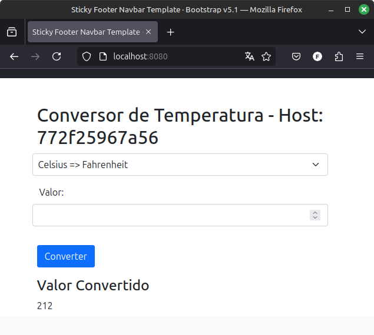

#Auteur : Fagner Geraldes Braga  
#Date de création : 27/01/2025  
#Date de mise à jour : 27/01/2025  
#Version : 0.01  

## IMAGE DE L’APPLICATION AVEC DOCKERFILE

### Tous les fichiers Dockerfile de cette partie sont dans le dossier température/src/

### Dockerfile01
[Dockerfile01](projets/celsius-farenheit/Dockerfile01)

```bash
# Change le répertoire actuel pour accéder au dossier source du projet
cd docker/projets/celsius-farenheit/

# Construit une image Docker à partir de Dockerfile01 et lui attribue un tag spécifique
docker build -t fagnerfgb/celsius-farenheit:v1 -f Dockerfile01 ./src

# Lancer un conteneur en arrière-plan à partir de l'image fagnerfgb/celsius-farenheit:v1
# Le conteneur sera accessible sur le port 8080 de la machine hôte
docker container run --name temperature -d -p 8080:8080 fagnerfgb/celsius-farenheit:v1

# Supprimer le conteneur nommé 'temperature' forcé, même s'il est en cours d'exécution
docker container rm -f temperature
```


