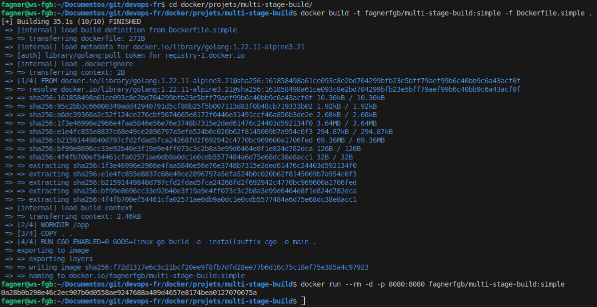

#Auteur : Fagner Geraldes Braga  
#Date de création : 29/01/2025  
#Date de mise à jour : 30/01/2025  
#Version : 0.02  

## Multi-stage build
### Création d’une image simple en utilisant GoLang et avec une application
### Tous les fichiers Dockerfile de cette partie sont dans le dossier projets/multi-stage-build

### Dockerfile.simple
[Dockerfile.simple](projets/multi-stage-build/Dockerfile.simple)

```bash
# Accéder au répertoire du projet multi-stage-build
cd docker/projets/multi-stage-build/

# Construire une image Docker en utilisant Dockerfile.simple et la taguer comme "fagnerfgb/multi-stage-build:simple"
docker build -t fagnerfgb/multi-stage-build:simple -f Dockerfile.simple .

# Lancer un conteneur en arrière-plan, exposant le port 8080, et supprimer le conteneur à la fin de son exécution
docker run --rm -d -p 8080:8080 fagnerfgb/multi-stage-build:simple
```



### Dockerfile.multistage
[Dockerfile.multistage](projets/multi-stage-build/Dockerfile.multistage)

```bash
# Construire une image Docker en utilisant Dockerfile.multistage et la taguer comme "fagnerfgb/multi-stage-build:multi"
docker build -t fagnerfgb/multi-stage-build:multi -f Dockerfile.multistage .

# Lancer un conteneur en arrière-plan, exposant le port 8181 local vers le port 8080 du conteneur,
# et supprimer le conteneur automatiquement après son arrêt
docker container run --rm -d -p 8181:8080 fagnerfgb/multi-stage-build:multi
```


### Construire l’image intermédiaire "build"
### Dockerfile.multistage
[Dockerfile.multistage](projets/multi-stage-build/Dockerfile.multistage)

```bash
# Construire une image Docker en utilisant Dockerfile.multistage et arrêter la construction après la phase "build"
docker build -t fagnerfgb/multi-stage-build:multi -f Dockerfile.multistage --target=build .

# Lancer un conteneur en arrière-plan, exposant le port 8282 local vers le port 8080 du conteneur
docker container run -d -p 8282:8080 fagnerfgb/multi-stage-build:multi
```

### Copier des fichiers à partir d’autres images
### Dockerfile.pacote-bin
[Dockerfile.pacote-bin](projets/multi-stage-build/Dockerfile.pacote-bin)

```bash
# Exécuter un conteneur temporaire en mode interactif avec l'image "fabricioveronez/pacote-bin:v1"
docker container run --rm -it fabricioveronez/pacote-bin:v1 /bin/sh

# Lister les fichiers et dossiers à l'intérieur du conteneur
ls

# Quitter le conteneur
exit
```


```bash
# Construire une image Docker à partir du Dockerfile "Dockerfile.pacote-bin"
docker build -t fagnerfgb/multi-stage-build-cp:multi -f Dockerfile.pacote-bin .

# Exécuter un conteneur en arrière-plan avec l'image créée et exposer le port 8080 sur l'hôte 8383
docker container run --rm --name ws-golang -d -p 8383:8080 fagnerfgb/multi-stage-build-cp:multi

# Accéder au conteneur en mode interactif
docker container exec -it ws-golang /bin/sh

# Lister les fichiers et répertoires dans le conteneur
ls

# Quitter le conteneur
exit
```


### Utilisation d’une image intermédiaire comme base pour une autre image
### Dockerfile.intermediaire
[Dockerfile.intermediaire](projets/multi-stage-build/Dockerfile.intermediaire)

```bash
# Construire une image Docker à partir du Dockerfile "Dockerfile.intermediaire"
docker build -t fagnerfgb/multi-stage-build:intermediaire -f Dockerfile.intermediaire .

# Exécuter un conteneur en arrière-plan avec l'image créée et exposer le port 8080 sur l'hôte 8484
docker container run --rm --name ws-golang-2 -d -p 8484:8080 fagnerfgb/multi-stage-build:intermediaire

# Accéder au conteneur en mode interactif
docker container exec -it ws-golang-2 /bin/sh

# Lister les fichiers et répertoires dans le conteneur
ls

# Quitter le conteneur
exit
```


### Enlèvement des conteneurs, des images et des autres choses
```bash
# Supprime tous les conteneurs Docker, y compris ceux qui sont en cours d'exécution, de manière forcée
docker container rm -f $(docker container ls -qa)

# Supprime toutes les images Docker, y compris celles qui ne sont pas utilisées, de manière forcée
docker image rm -f $(docker image ls -qa)

# Nettoie les images Docker inutilisées, en supprimant celles qui ne sont plus associées à un conteneur
docker image prune

# Nettoie l'ensemble du système Docker en supprimant les conteneurs, images, volumes et réseaux inutilisés
docker system prune
```