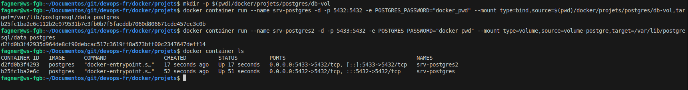

#Auteur : Fagner Geraldes Braga  
#Date de création : 03/02/2025  
#Date de mise à jour : 03/02/2025  
#Version : 0.01  

## Volumes
### Bind Mount
```bash

# Crée un répertoire "09-volumes" dans le chemin actuel sous "docker" s'il n'existe pas
mkdir -p $(pwd)/docker/09-volumes

# Démarre un conteneur Ubuntu en mode interactif avec suppression automatique après l'arrêt
# Monte le répertoire local "docker/09-volumes" dans le conteneur sous "/app"
docker container run --rm -it --mount type=bind,source="$(pwd)/docker/09-volumes",target=/app ubuntu /bin/bash

# Écrit le texte "Volume Bind" dans un fichier nommé "volume.txt" situé dans le dossier monté "/app"
echo "Volume Bind" > /app/volume.txt

# Affiche le contenu du fichier "volume.txt" pour vérifier qu'il a bien été écrit
cat /app/volume.txt 

# Quitte le conteneur et ferme le terminal interactif
exit
```


[Dockerfile-bind](/docker/09-volumes/Dockerfile-bind)
```bash
# Construit une image Docker nommée "fagnerfgb/volume-bind:v1" en utilisant le fichier Dockerfile-bind
# situé dans le répertoire "docker/09-volumes" du chemin actuel
docker build -t fagnerfgb/volume-bind:v1 -f $(pwd)/docker/09-volumes/Dockerfile-bind .

# Démarre un conteneur basé sur l'image "fagnerfgb/volume-bind:v1" en mode interactif avec suppression automatique après l'arrêt
# Monte le répertoire local "docker/09-volumes" dans le conteneur sous "/app"
docker container run --rm -it --mount type=bind,source="$(pwd)/docker/09-volumes",target=/app fagnerfgb/volume-bind:v1 /bin/bash

# Crée un fichier "volume2.txt" et y écrit "Volume Bind 2" dans le répertoire de travail actuel (monté sous /app)
echo "Volume Bind 2" > volume2.txt

# Liste les fichiers du répertoire actuel avec des détails sur leur taille et leurs permissions
ls -lh

# Quitte le conteneur et ferme le terminal interactif
exit
```


### Bind de répertoire
```bash
# Démarre un conteneur en arrière-plan (-d) basé sur l'image "nginx"
# Redirige le port 8080 de la machine hôte vers le port 80 du conteneur (-p 8080:80)
# Monte le répertoire local "docker/projets/imc" dans le conteneur sous "/usr/share/nginx/html"
# Cela permet de servir les fichiers HTML du dossier local via Nginx
docker container run -d -p 8080:80 -v $(pwd)/docker/projets/imc:/usr/share/nginx/html nginx
```


### Docker Volume
#### Commandes de base
```bash
# Crée un volume Docker nommé "volume-fgb"
docker volume create volume-fgb

# Liste tous les volumes Docker existants sur la machine
docker volume ls

# Affiche les détails du volume "volume-fgb", y compris son chemin sur le système hôte
docker volume inspect volume-fgb

# Supprime le volume "volume-fgb"
docker volume rm volume-fgb

# Crée à nouveau le volume "volume-fgb"
docker volume create volume-fgb

# Démarre un conteneur Ubuntu en mode interactif avec suppression automatique après l'arrêt
# Monte le volume "volume-fgb" dans le conteneur sous "/app"
docker container run --rm -it --mount type=volume,source=volume-fgb,target=/app ubuntu /bin/bash

# Crée un fichier "docker-volume.txt" dans "/app" et y écrit "Docker Volume"
echo "Docker Volume" > /app/docker-volume.txt

# Affiche le contenu du fichier "docker-volume.txt" pour vérifier qu'il a bien été écrit
cat /app/docker-volume.txt 

# Quitte le conteneur et ferme le terminal interactif
exit
```


```bash
# Démarre un conteneur Ubuntu en mode interactif avec suppression automatique après l'arrêt
# Monte le volume "volume-fgb" dans le conteneur sous "/app"
docker container run --rm -it --mount type=volume,source=volume-fgb,target=/app ubuntu /bin/bash

# Affiche le contenu du fichier "docker-volume.txt" qui a été précédemment créé dans le volume
cat /app/docker-volume.txt 

# Quitte le conteneur et ferme le terminal interactif
exit
```


[Dockerfile-volume](/docker/09-volumes/Dockerfile-volume)

```bash
# Construit une image Docker nommée "fagnerfgb/volume:v1" en utilisant le fichier Dockerfile-volume
# situé dans le répertoire "docker/09-volumes" du chemin actuel
docker build -t fagnerfgb/volume:v1 -f $(pwd)/docker/09-volumes/Dockerfile-volume .

# Démarre un conteneur basé sur l'image "fagnerfgb/volume:v1" en mode interactif avec suppression automatique après l'arrêt
# Monte le volume Docker "volume-fgb" dans le conteneur sous "/app"
docker container run --rm -it -v volume-fgb:/app fagnerfgb/volume:v1 /bin/bash

# Crée un fichier "docker-volume-02.txt" dans "/app" et y écrit "Docker Volume 2"
echo "Docker Volume 2" > /app/docker-volume-02.txt

# Affiche le contenu du fichier "docker-volume-02.txt" pour vérifier qu'il a bien été écrit
cat /app/docker-volume-02.txt 

# Quitte le conteneur et ferme le terminal interactif
exit
```


```bash
# Démarre un conteneur basé sur l'image "fagnerfgb/volume:v1" en mode interactif avec suppression automatique après l'arrêt
# Monte le volume Docker "volume-fgb" dans le conteneur sous "/app"
docker container run --rm -it -v volume-fgb:/app fagnerfgb/volume:v1 /bin/bash

# Affiche le contenu du fichier "docker-volume-02.txt" qui a été précédemment créé dans le volume
cat /app/docker-volume-02.txt 

# Quitte le conteneur et ferme le terminal interactif
exit
```


### Sauvegarde d’un volume docker
```bash
# Construit une image Docker nommée "fagnerfgb/volume:v1" en utilisant le fichier Dockerfile-volume
# situé dans le répertoire "docker/09-volumes" du chemin actuel
docker build -t fagnerfgb/volume:v1 -f $(pwd)/docker/09-volumes/Dockerfile-volume .

# Démarre un conteneur en mode interactif basé sur l'image "fagnerfgb/volume:v1"
# Donne au conteneur le nom "srv-volume"
docker container run --name srv-volume -it fagnerfgb/volume:v1 /bin/bash
```

```bash
# Crée un fichier nommé "fichier01.txt" et écrit "Fichier01" dedans
echo "Fichier01" > fichier01.txt

# Crée un fichier nommé "fichier02.txt" et écrit "Fichier02" dedans
echo "Fichier02" > fichier02.txt

# Quitte le terminal ou le conteneur en cours d'exécution
exit
```

```bash
# Démarre un conteneur basé sur l'image "fagnerfgb/volume:v1" en mode temporaire (--rm)
# Monte tous les volumes du conteneur "srv-volume" (--volumes-from srv-volume)
# Monte également le répertoire actuel ($(pwd)) sous "/backup"
# Archive le contenu du volume "/app" dans un fichier "bkp_vol.tar" stocké dans "/backup"
docker container run --volumes-from srv-volume --rm -v $(pwd):/backup fagnerfgb/volume:v1 tar cvf /backup/bkp_vol.tar /app

# Crée un nouveau volume Docker nommé "volume-restore"
docker volume create volume-restore

# Démarre un conteneur basé sur l'image "fagnerfgb/volume:v1"
# Monte le répertoire actuel ($(pwd)) sous "/backup" pour récupérer l'archive
# Monte le volume "volume-restore" sous "/app" où les fichiers seront restaurés
# Extrait le contenu de l'archive "bkp_vol.tar" dans "/app"
docker container run -v $(pwd):/backup -v volume-restore:/app fagnerfgb/volume:v1 tar xvf /backup/bkp_vol.tar
```


### Exemple avec un docker volume (Bind)

```bash
# Crée un répertoire pour stocker les données PostgreSQL en mode persistant
mkdir -p $(pwd)/docker/projets/postgres/db-vol

# Démarre un conteneur PostgreSQL nommé "srv-postgres" en arrière-plan (-d)
# Mappe le port 5432 du conteneur sur le port 5432 de l'hôte (-p 5432:5432)
# Définit le mot de passe de l'utilisateur "postgres" avec la variable d'environnement POSTGRES_PASSWORD
# Monte le répertoire local "db-vol" dans le conteneur sous "/var/lib/postgresql/data"
# Cela permet de stocker les données PostgreSQL sur l'hôte et de les conserver même après l'arrêt du conteneur
docker container run --name srv-postgres -d -p 5432:5432 \
  -e POSTGRES_PASSWORD="docker_pwd" \
  --mount type=bind,source=$(pwd)/docker/projets/postgres/db-vol,target=/var/lib/postgresql/data \
  postgres
```
### Exemple avec un volume docker (Volume)
```bash
# Démarre un conteneur PostgreSQL nommé "srv-postgres2" en arrière-plan (-d)
# Mappe le port 5432 du conteneur sur le port 5433 de l'hôte (-p 5433:5432)
# Définit le mot de passe de l'utilisateur "postgres" avec la variable d'environnement POSTGRES_PASSWORD
# Monte un volume Docker nommé "volume-postgre" pour stocker les données de PostgreSQL de manière persistante
# Le volume est monté sur "/var/lib/postgresql/data", qui est le répertoire de stockage des bases de données PostgreSQL
docker container run --name srv-postgres2 -d -p 5433:5432 \
  -e POSTGRES_PASSWORD="docker_pwd" \
  --mount type=volume,source=volume-postgre,target=/var/lib/postgresql/data \
  postgres
```



```bash
# Supprime tous les conteneurs Docker, y compris ceux qui sont en cours d'exécution et arrêtés
# -f : force la suppression des conteneurs même s'ils sont en cours d'exécution
# $(docker container ls -qa) : liste tous les identifiants de conteneurs (-q) sans afficher les détails, y compris les conteneurs arrêtés (-a)
docker container rm -f $(docker container ls -qa)
```

### Exemple avec tmpfs
```bash
# Démarre un conteneur interactif basé sur l'image "ubuntu:22.04"
# -it : lance le conteneur en mode interactif avec un terminal attaché
# --mount type=tmpfs,target=/app : monte un système de fichiers temporaire (tmpfs) sur le chemin "/app" dans le conteneur
# ubuntu:22.04 : utilise l'image Ubuntu 22.04
# /bin/bash : exécute un shell Bash dans le conteneur
docker container run -it --mount type=tmpfs,target=/app ubuntu:22.04 /bin/bash

# Supprime tous les conteneurs Docker, y compris ceux qui sont en cours d'exécution et arrêtés
# -f : force la suppression des conteneurs même s'ils sont en cours d'exécution
# $(docker container ls -qa) : liste tous les identifiants de conteneurs (-q) sans afficher les détails, y compris les conteneurs arrêtés (-a)
docker container rm -f $(docker container ls -qa)
```