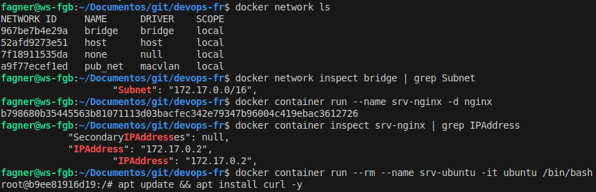
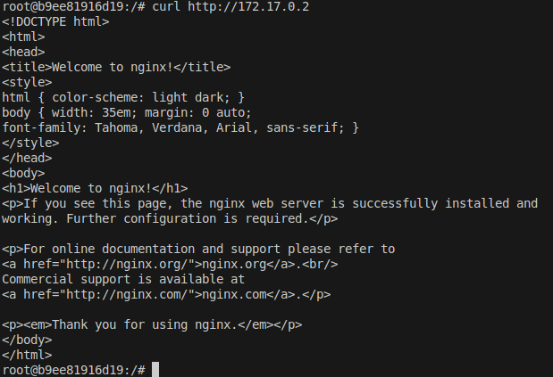
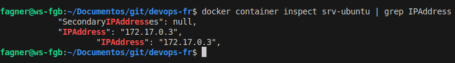
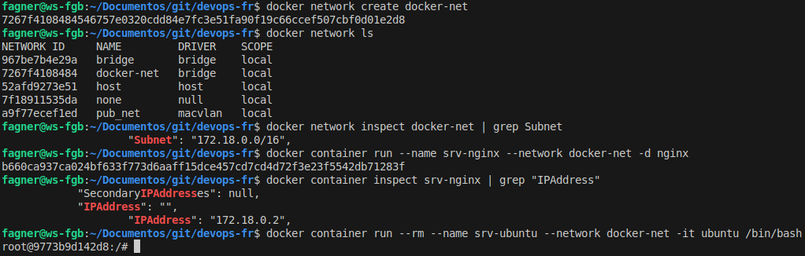
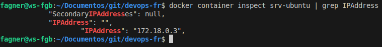
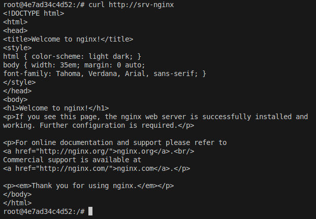
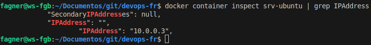
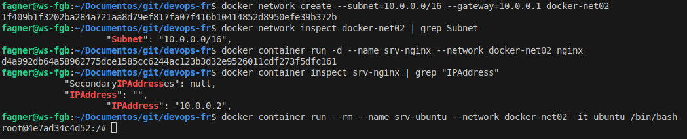
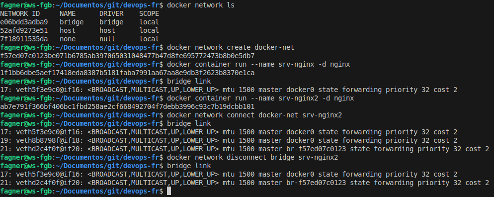

#Auteur : Fagner Geraldes Braga  
#Date de création : 04/02/2025  
#Date de mise à jour : 04/02/2025  
#Version : 0.01  

### Docker Network
```bash
# Affiche la liste de tous les réseaux Docker disponibles sur l'hôte
docker network ls

# Affiche les détails du réseau "bridge" et filtre uniquement la ligne contenant "Subnet"
# Cela permet de voir la plage d'adresses IP utilisée par le réseau bridge par défaut
docker network inspect bridge | grep Subnet

# Démarre un conteneur nommé "srv-nginx" en arrière-plan (-d) basé sur l'image Nginx
docker container run --name srv-nginx -d nginx

# Affiche les informations détaillées du conteneur "srv-nginx"
# Filtre uniquement la ligne contenant "IPAddress" pour voir son adresse IP dans le réseau Docker
docker container inspect srv-nginx | grep IPAddress

# Démarre un conteneur Ubuntu en mode interactif (--it) avec un terminal Bash
# --rm : Supprime automatiquement le conteneur après son arrêt
# Cela permet de tester et de faire des commandes sans laisser de conteneurs inutiles après utilisation
docker container run --rm --name srv-ubuntu -it ubuntu /bin/bash

```

```bash
# Affiche les informations détaillées du conteneur "srv-ubuntu"
# Filtre uniquement la ligne contenant "IPAddress" pour voir son adresse IP dans le réseau Docker
docker container inspect srv-ubuntu | grep IPAddress
```

```bash
# Met à jour la liste des paquets disponibles et installe "curl" sans demander de confirmation (-y)
apt update && apt install curl -y

# Envoie une requête HTTP à l'adresse IP "172.17.0.2" pour tester la connexion
# Cela peut être utilisé pour vérifier si un serveur web (comme Nginx) fonctionne correctement dans un autre conteneur Docker
curl http://172.17.0.2

# Quitte le terminal du conteneur et arrête son exécution
exit
```






### Réseau Bridge
```bash
# Supprime de force (-f) le conteneur nommé "srv-nginx" s'il existe
docker container rm -f srv-nginx

# Crée un nouveau réseau Docker personnalisé nommé "docker-net"
docker network create docker-net

# Affiche la liste de tous les réseaux Docker disponibles sur l'hôte
docker network ls

# Affiche les détails du réseau "docker-net" et filtre uniquement la ligne contenant "Subnet"
# Cela permet de voir la plage d'adresses IP utilisée par ce réseau personnalisé
docker network inspect docker-net | grep Subnet

# Démarre un conteneur Nginx nommé "srv-nginx" et le connecte au réseau "docker-net"
# -d : Exécute le conteneur en arrière-plan
docker container run --name srv-nginx --network docker-net -d nginx

# Affiche les informations détaillées du conteneur "srv-nginx"
# Filtre uniquement la ligne contenant "IPAddress" pour voir son adresse IP dans le réseau "docker-net"
docker container inspect srv-nginx | grep "IPAddress"

# Démarre un conteneur Ubuntu en mode interactif (--it) avec un terminal Bash
# --rm : Supprime automatiquement le conteneur après son arrêt
# --network docker-net : Connecte le conteneur au réseau "docker-net" pour qu'il puisse communiquer avec "srv-nginx"
docker container run --rm --name srv-ubuntu --network docker-net -it ubuntu /bin/bash
```

```bash
# Affiche les informations détaillées du conteneur "srv-ubuntu"
# Filtre uniquement la ligne contenant "IPAddress" pour voir son adresse IP dans le réseau Docker
docker container inspect srv-ubuntu | grep IPAddress
```

```bash
# Met à jour la liste des paquets disponibles et installe "curl" sans demander de confirmation (-y)
apt update && apt install curl -y

# Envoie une requête HTTP au conteneur "srv-nginx" via son nom de service dans le réseau Docker "docker-net"
# Cette requête permet de vérifier si le serveur Nginx fonctionne et est accessible depuis ce conteneur
curl http://srv-nginx

# Quitte le terminal du conteneur et arrête son exécution
exit
```







```bash
# Supprime de force (-f) le conteneur nommé "srv-nginx" s'il existe
docker container rm -f srv-nginx

# Crée un réseau Docker personnalisé nommé "docker-net02"
# --subnet=10.0.0.0/16 définit une plage d'adresses IP (10.0.0.0 à 10.0.255.255)
# --gateway=10.0.0.1 définit l'adresse IP de la passerelle pour ce réseau
docker network create --subnet=10.0.0.0/16 --gateway=10.0.0.1 docker-net02

# Vérifie les informations du réseau "docker-net02" et filtre uniquement la ligne contenant "Subnet"
docker network inspect docker-net02 | grep Subnet

# Démarre un conteneur Nginx nommé "srv-nginx" et le connecte au réseau "docker-net02"
# -d : Exécute le conteneur en arrière-plan
docker container run -d --name srv-nginx --network docker-net02 nginx

# Affiche les informations détaillées du conteneur "srv-nginx"
# Filtre uniquement la ligne contenant "IPAddress" pour voir son adresse IP attribuée dans "docker-net02"
docker container inspect srv-nginx | grep "IPAddress"

# Démarre un conteneur Ubuntu en mode interactif (--it) avec un terminal Bash
# --rm : Supprime automatiquement le conteneur après son arrêt
# --network docker-net02 : Connecte le conteneur au réseau "docker-net02" pour qu'il puisse communiquer avec "srv-nginx"
docker container run --rm --name srv-ubuntu --network docker-net02 -it ubuntu /bin/bash
```

```bash
# Affiche les informations détaillées du conteneur "srv-ubuntu"
# Filtre uniquement la ligne contenant "IPAddress" pour voir son adresse IP dans le réseau Docker
docker container inspect srv-ubuntu | grep IPAddress

# Vérifie les informations du réseau "docker-net02"
# Filtre uniquement la ligne contenant "IPv4Address" pour voir les adresses IP des conteneurs connectés à ce réseau
docker network inspect docker-net02 | grep IPv4Address
```

```bash
# Met à jour la liste des paquets et installe "curl" sans demander de confirmation (-y)
apt update && apt install curl -y

# Envoie une requête HTTP au conteneur "srv-nginx" via son nom de service dans le réseau Docker "docker-net02"
# Cela permet de vérifier si le serveur Nginx est accessible depuis ce conteneur
curl http://srv-nginx

# Quitte le terminal du conteneur et arrête son exécution
exit
```





```bash
# Supprime les réseaux Docker inutilisés
docker network prune

# Liste de tous les réseaux Docker disponibles sur l'hôte
docker network ls

# Affiche les informations réseau de l'hôte
# "ip address" ou "ip a" donne les interfaces réseau de la machine hôte
ip address

# Affiche les informations du réseau "bridge" (réseau par défaut de Docker)
docker network inspect bridge

# Crée un nouveau réseau Docker personnalisé appelé "docker-net"
docker network create docker-net

# Affiche les interfaces réseau de l'hôte
ip a

# Inspecte les détails du réseau "docker-net" nouvellement créé
docker network inspect docker-net

# Démarre un conteneur Nginx nommé "srv-nginx" en mode détaché (-d)
docker container run --name srv-nginx -d nginx

# Affiche les interfaces réseau sur l'hôte après l'exécution du conteneur
ip a

# Affiche des informations sur les interfaces réseau "bridge"
bridge link

# Démarre un second conteneur Nginx nommé "srv-nginx2" en mode détaché (-d)
docker container run --name srv-nginx2 -d nginx

# Affiche les interfaces réseau sur l'hôte après le démarrage du deuxième conteneur
ip a

# Connecte le conteneur "srv-nginx2" au réseau personnalisé "docker-net"
docker network connect docker-net srv-nginx2

# Affiche les interfaces réseau sur l'hôte après avoir connecté le conteneur
ip a

# Affiche des informations sur les interfaces réseau "bridge"
bridge link

# Déconnecte le conteneur "srv-nginx2" du réseau "bridge"
docker network disconnect bridge srv-nginx2

# Affiche des informations sur les interfaces réseau "bridge" après la déconnexion
bridge link

# Supprime tous les conteneurs en cours d'exécution ou arrêtés
docker container rm -f $(docker container ls -qa)

# Supprime de nouveau les réseaux Docker inutilisés
docker network prune
```



### Réseau Host
```bash
# Démarre un conteneur Nginx nommé "srv-nginx" en mode détaché (-d) en utilisant le réseau "host"
# L'option "--network=host" permet au conteneur de partager le réseau de l'hôte directement
docker container run --name srv-nginx -d --network=host nginx

# Inspecte les informations détaillées du conteneur "srv-nginx" et filtre les lignes contenant "host"
# Cela permet d'afficher les détails du réseau d'hôte utilisé par le conteneur
docker container inspect srv-nginx | grep '"host":' -A 2 -B 1

# Affiche les interfaces réseau sur l'hôte pour vérifier les configurations réseau
ip a

# Supprime tous les conteneurs (en cours d'exécution ou arrêtés)
docker container rm -f $(docker container ls -qa)
```

### Réseau None
```bash
# Démarre un conteneur Ubuntu nommé "srv-ubuntu" en mode interactif (-it) et avec un terminal Bash
# L'option --rm supprime automatiquement le conteneur une fois qu'il est arrêté
# --network=none : Ne connecte pas le conteneur à un réseau Docker, le rendant isolé de l'extérieur
docker container run --rm --name srv-ubuntu -it --network=none ubuntu /bin/bash
```

```bash
# Inspecte le conteneur "srv-ubuntu" et filtre les lignes contenant '"none":'
# Cette commande permet de vérifier les détails du réseau et de confirmer que le conteneur n'est connecté à aucun réseau Docker
docker container inspect srv-ubuntu | grep '"none":' -A 2 -B 1
```

```bash
# Quitte le terminal du conteneur Ubuntu et arrête son exécution
exit
```

### Ajouter les noms dns au conteneur
```bash
# Recherche l'interface réseau correspondant à "wlx002e2d30422c" et affiche les informations la concernant
# Cela permet de trouver les détails de l'interface sans afficher toutes les interfaces
ip a | grep wlx002e2d30422c

# Démarre un conteneur Nginx nommé "srv-nginx" en mode détaché (-d) en utilisant le réseau "host"
# Cela permet au conteneur d'utiliser le réseau de l'hôte directement, sans isolation réseau Docker
docker container run --name srv-nginx -d --network=host nginx

# Démarre un conteneur Ubuntu en mode interactif (-it) avec l'option --rm pour le supprimer automatiquement après son arrêt
# L'option --add-host permet d'ajouter une entrée à /etc/hosts, ici "fagner.com" pointe vers l'adresse IP 192.168.2.20
docker container run --rm --name srv-ubuntu --add-host=fagner.com:192.168.2.20 -it ubuntu /bin/bash
```

```bash
# Met à jour les informations des paquets disponibles et installe "curl" sans demander de confirmation (-y)
apt update && apt install curl -y

# Utilise "curl" pour accéder à "fagner.com" et récupérer la réponse du serveur (qui doit pointer vers 192.168.2.20 selon l'ajout de l'hôte)
curl fagner.com

# Quitte le terminal du conteneur Ubuntu et arrête son exécution
exit
```

```bash
# Supprime tous les conteneurs Docker (en cours d'exécution ou arrêtés) de manière forcée (-f)
# La commande "docker container ls -qa" liste tous les IDs de conteneurs (en cours d'exécution ou non) dans le système
docker container rm -f $(docker container ls -qa)
```