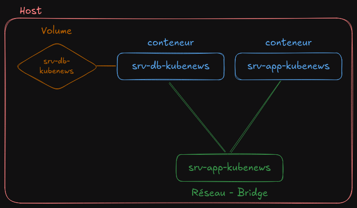

#Auteur : Fagner Geraldes Braga  
#Date de création : 05/02/2025  
#Date de mise à jour : 05/02/2025  
#Version : 0.01  

### Création d’image avec l’application

### Dockerfile
[Dockerfile](/docker/projets/kube-news/src/Dockerfile)



```bash
# Se déplace vers le répertoire contenant le projet "kube-news"
cd $(pwd)/docker/projets/kube-news

# Construit une image Docker nommée "fagnerfgb/kube-news:v1" en utilisant le Dockerfile situé dans "src/"
docker build -t fagnerfgb/kube-news:v1 -f Dockerfile src/

# Crée un tag "latest" pour l'image "fagnerfgb/kube-news:v1"
docker tag fagnerfgb/kube-news:v1 fagnerfgb/kube-news:latest

# Se connecte à Docker Hub ou à un registre privé (nécessite des identifiants)
docker login

# Pousse l'image avec la version "v1" vers le registre Docker
docker push fagnerfgb/kube-news:v1

# Pousse également l'image avec le tag "latest" vers le registre Docker
docker push fagnerfgb/kube-news:latest
```

### Création du réseau kube-news-net
```bash
# Crée un réseau Docker nommé "kube-news-net"
docker network create kube-news-net

# Vérifie les détails du réseau "kube-news-net" et filtre uniquement la ligne contenant "Subnet"
docker network inspect kube-news-net | grep Subnet
```

### Création du conteneur Postgres
```bash
# Crée un volume Docker nommé "srv-db-kubenews" pour stocker les données de la base PostgreSQL
docker volume create srv-db-kubenews

# Démarre un conteneur PostgreSQL nommé "srv-db-kubenews" en arrière-plan (-d)
docker container run --name srv-db-kubenews -d \
  -p 5432:5432 \  # Expose PostgreSQL sur le port 5432 de l'hôte
  -e POSTGRES_PASSWORD="pwdkubenews" \  # Définit le mot de passe de l'utilisateur PostgreSQL
  -e POSTGRES_USER=kubenews \  # Crée l'utilisateur "kubenews"
  -e POSTGRES_DB=kubenews \  # Crée la base de données "kubenews"
  --network=kube-news-net \  # Connecte le conteneur au réseau "kube-news-net"
  -v srv-db-kubenews:/var/lib/postgresql/data \  # Monte le volume pour stocker les données
  postgres  # Utilise l'image officielle PostgreSQL

# Affiche la liste des conteneurs en cours d'exécution
docker container ls
```

### Création du conteneur d’application
```bash
# Démarre un conteneur pour l'application "kube-news"
docker container run --name srv-app-kubenews -d \
  -p 8080:8080 \  # Expose l'application sur le port 8080 de l'hôte
  -e DB_DATABASE=kubenews \  # Définit le nom de la base de données
  -e DB_USERNAME=kubenews \  # Définit l'utilisateur de la base de données
  -e DB_PASSWORD=pwdkubenews \  # Définit le mot de passe pour accéder à la base
  -e DB_HOST=srv-db-kubenews \  # Définit l'hôte de la base de données (nom du conteneur PostgreSQL)
  --network=kube-news-net \  # Connecte l'application au réseau "kube-news-net"
  fagnerfgb/kube-news:v1  # Utilise l'image Docker de l'application

# Vérifie les conteneurs connectés au réseau "kube-news-net"
docker network inspect kube-news-net | grep Containers -A 14
```

### Mise à jour de l’application
```bash
# Construire une nouvelle image Docker pour l'application kube-news (version 2)
docker build -t fagnerfgb/kube-news:v2 -f Dockerfile src/

# Taguer l'image v2 comme "latest" pour la mise à jour automatique
docker tag fagnerfgb/kube-news:v2 fagnerfgb/kube-news:latest

# Se connecter à Docker Hub (nécessite des identifiants)
docker login

# Pousser les images sur Docker Hub (v2 et latest)
docker push fagnerfgb/kube-news:v2 && docker push fagnerfgb/kube-news:latest

# Supprimer le conteneur en cours d'exécution de l'application kube-news
docker container rm -f srv-app-kubenews
```

### Création du conteneur de l’application mise à jour
```bash
# Démarrer un nouveau conteneur pour l'application kube-news (version 2)
docker container run --name srv-app-kubenews-v2 -d -p 8080:8080 \
  -e DB_DATABASE=kubenews -e DB_USERNAME=kubenews -e DB_PASSWORD=pwdkubenews \
  -e DB_HOST=srv-db-kubenews --network=kube-news-net fagnerfgb/kube-news:v2

```

### Élimination des conteneurs, des images, des réseaux et des caches
```bash
# Supprime tous les conteneurs en cours et arrêtés
docker container rm -f $(docker container ls -qa)

# Supprime toutes les images Docker présentes sur la machine
docker image rm -f $(docker image ls -qa)

# Supprime les images inutilisées (dangling images)
docker image prune

# Supprime tous les réseaux Docker inutilisés
docker network prune

# Supprime toutes les données de cache du builder Docker
docker builder prune -a
```